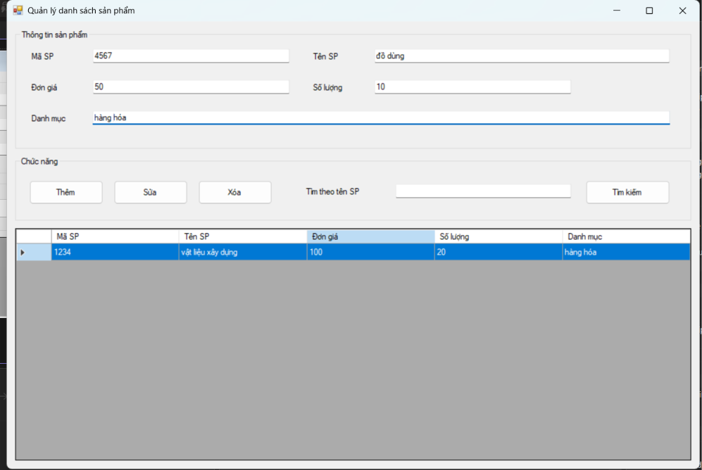
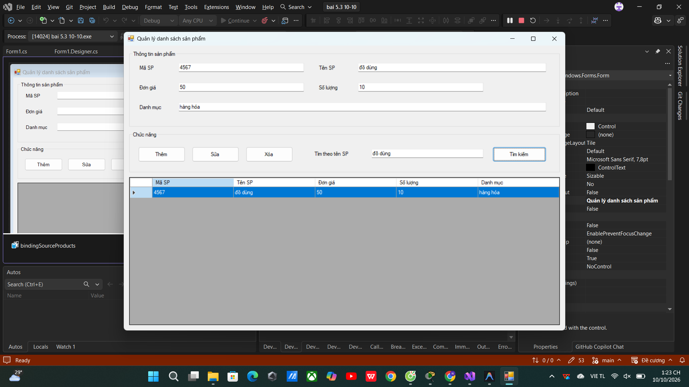
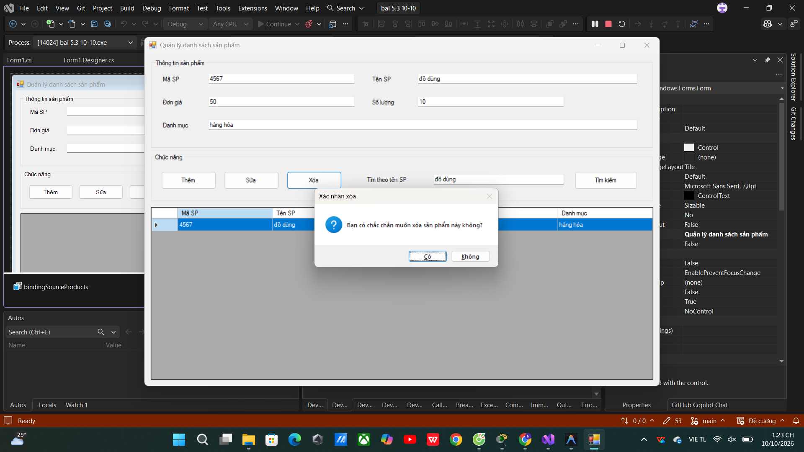
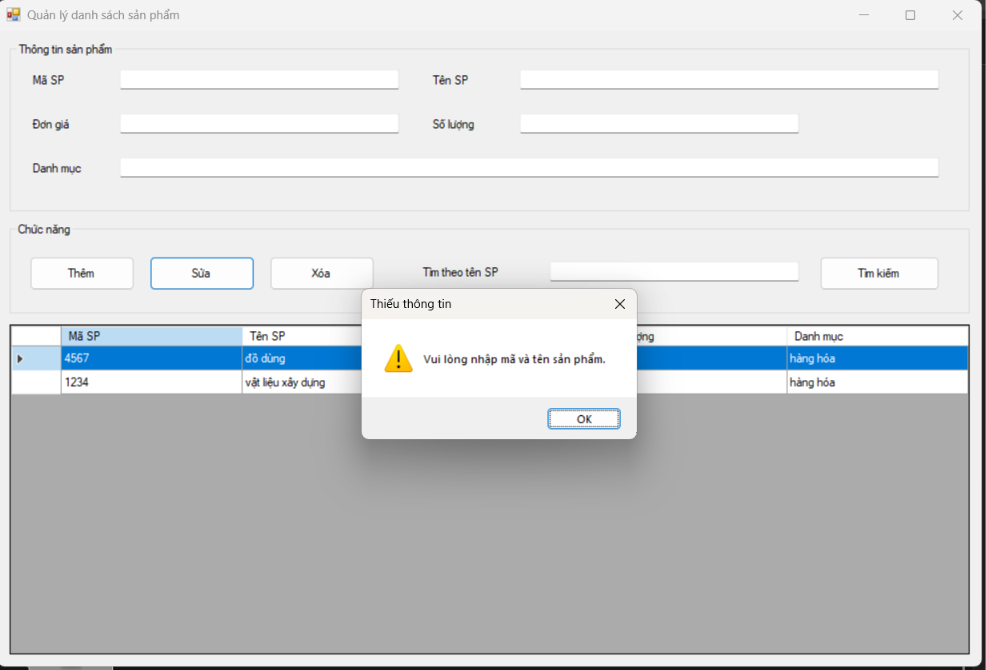
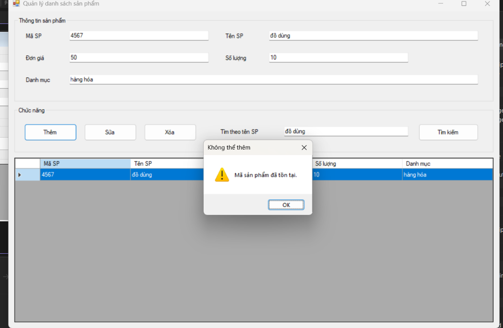

# BÁO CÁO BÀI TẬP / ĐỒ ÁN

## THÔNG TIN SINH VIÊN
- **Họ và tên:** Nguyễn Phúc Vượng
- **Mã số sinh viên:** 24810320187
- **Lớp:** D19QTANM1
- **Tên môn học:** Lập trình C# / Windows Forms
- **Tên bài tập:** Bài 5.3 – Quản Lý Sản Phẩm với DataGridView (10/10)

---

## KẾT QUẢ THỰC HÀNH

### 1. Ảnh màn hình Giao diện chính

### 2. Ảnh màn hình Chức năng thực thi / Kết quả

### 3. Ảnh màn hình Kiểm tra lỗi (Validation)

