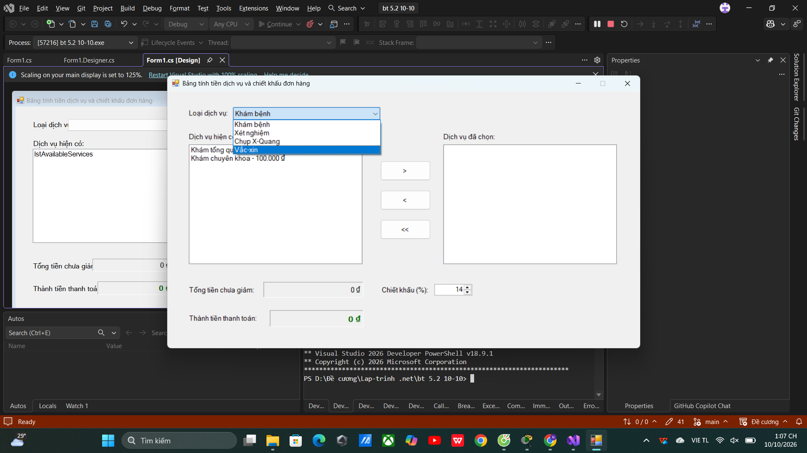
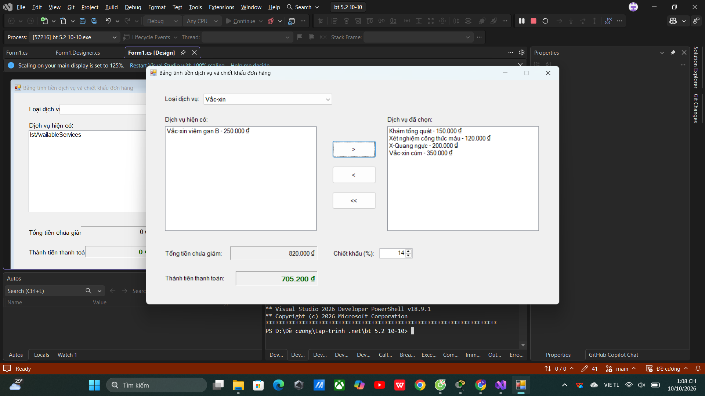

Cấu trúc file README.md mẫu
Trước khi bắt đầu các lệnh Git, sinh viên cần tạo hoặc chỉnh sửa file README.md
tại thư mục gốc của dự án theo đúng cấu trúc mẫu sau:
Markdown
# BÁO CÁO BÀI TẬP / ĐỒ ÁN

## THÔNG TIN SINH VIÊN
- **Họ và tên:** Nguyễn Văn A
- **Mã số sinh viên:** 20123456
- **Lớp:** 20DTHxx
- **Tên môn học:** Lập trình C# / Windows Forms
- **Tên bài tập:** [Điền tên bài tập tại đây]

## KẾT QUẢ THỰC HÀNH

### 1. Ảnh màn hình Giao diện chính

### 2. Ảnh màn hình Chức năng thực thi / Kết quả

### 3. Ảnh màn hình Kiểm tra lỗi (Validation)
Cấu trúc file README.md mẫu
Trước khi bắt đầu các lệnh Git, sinh viên cần tạo hoặc chỉnh sửa file README.md
tại thư mục gốc của dự án theo đúng cấu trúc mẫu sau:
Markdown
# BÁO CÁO BÀI TẬP / ĐỒ ÁN

## THÔNG TIN SINH VIÊN
- **Họ và tên:** Nguyễn Văn A
- **Mã số sinh viên:** 20123456
- **Lớp:** 20DTHxx
- **Tên môn học:** Lập trình C# / Windows Forms
- **Tên bài tập:** [Điền tên bài tập tại đây]

## KẾT QUẢ THỰC HÀNH

### 1. Ảnh màn hình Giao diện chính

### 2. Ảnh màn hình Chức năng thực thi / Kết quả

### 3. Ảnh màn hình Kiểm tra lỗi (Validation)

Mẹo chèn ảnh vào README.md:
1. Tạo thư mục tên là screenshots trong thư mục project.
2. Chụp ảnh màn hình bằng tổ hợp phím Windows + Shift + S (trên Windows)
hoặc Cmd + Shift + 4 (trên Mac).
3. Lưu ảnh vào thư mục screenshots (ví dụ: main_ui.png,
execution_result.png).
4. Nhúng đúng đường dẫn ./screenshots/tên_ảnh.png vào file README.md
như mẫu trên.

QUY TRÌNH 5 BƯỚC

Mẹo chèn ảnh vào README.md:
1. Tạo thư mục tên là screenshots trong thư mục project.
2. Chụp ảnh màn hình bằng tổ hợp phím Windows + Shift + S (trên Windows)
hoặc Cmd + Shift + 4 (trên Mac).
3. Lưu ảnh vào thư mục screenshots (ví dụ: main_ui.png,
execution_result.png).
4. Nhúng đúng đường dẫn ./screenshots/tên_ảnh.png vào file README.md
như mẫu trên.

QUY TRÌNH 5 BƯỚC# BÁO CÁO BÀI TẬP / ĐỒ ÁN

## THÔNG TIN SINH VIÊN
- **Họ và tên:** Nguyễn Phúc Vượng
- **Mã số sinh viên:** 24810320187
- **Lớp:** D19QTANM1
- **Tên môn học:** Lập trình C# / Windows Forms
- **Tên bài tập:** Bài tập 5.2 – Form Đăng Ký Dịch Vụ Y Tế (10/10)

---

## KẾT QUẢ THỰC HÀNH

### 1. Ảnh màn hình Giao diện chính

### 2. Ảnh màn hình Chức năng thực thi / Kết quả

### 3. Ảnh màn hình Kiểm tra lỗi (Validation)
> Bài này sử dụng ListBox để chọn dịch vụ, không có form validation lỗi riêng.
> Xem ảnh kết quả tính tiền ở mục 2.
